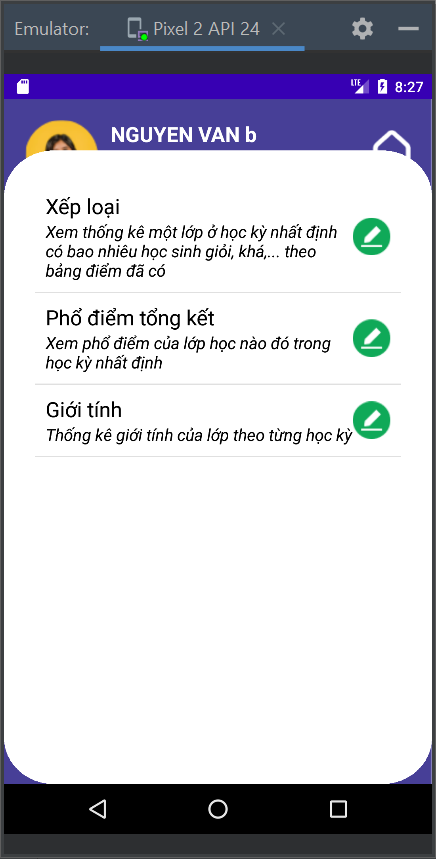
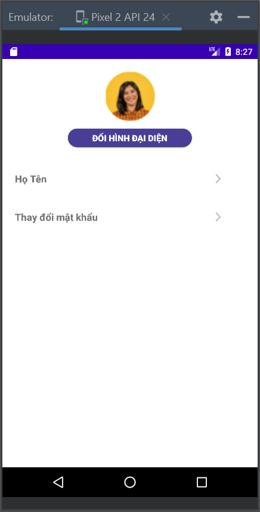

<h1 align="center">Phát Triển Ứng Dụng Cho Các Thiết Bị Di Động 
    Đồ Án Giữa Kỳ - Quản Lý Học Sinh/Sinh Viên
</h1>

    

# [**Table Of Content**](#table-of-content)
- [**Table Of Content**](#table-of-content)
- [**Introduction**](#introduction)
- [**Usage**](#usage)
- [**Base-lined Knowledge**](#base-lined-knowledge)
- [**Reading Comprehension**](#reading-comprehension)
- [**Video**](#video)
- [**Features**](#features)
  - [**1. Login**](#1-login)
  - [**2. Home**](#2-home)
  - [**3. Classroom**](#3-classroom)
  - [**4. Subject**](#4-subject)
  - [**5. Statistics**](#5-statistics)
  - [**6. Event**](#6-event)
  - [**7. Score**](#7-score)
  - [**8. Account**](#8-account)
  - [**9. Settings**](#9-settings)
- [**Post Script**](#post-script)
- [**Our Team**](#our-team)
- [**Made with 💘 and Java **](#made-with--and-java-)

# [**Introduction**](#introduction)

Sau đây là toàn bộ nội dung đề tài của nhóm mình tới đề tài quản lý sinh viên

    

    

    

    

    

# [**Usage**](#usage)

Để chạy được dự án này, yêu cầu Android Studio Bumblebee phiên bản 2021.1.1 Patch 2 hoặc mới hơn. Dự án này có thể tải bằng 2 cách sau đây:

- Tải về bằng `Code->Download Zip`

- Tải về bằng câu lệnh `git clone`

Sau khi tải về, để chạy được ứng dụng này cần lưu ý ở lần chạy đầu tiên. Hãy chọn nút màu xanh như hình minh họa để khởi tạo dữ liệu mặc định

    

<h3 align="center">

***Nút đăng ký demo giúp tạo dữ liệu ban đầu***
</h3>

# [**Base-lined Knowledge**](#base-lined-knowledge)

Những kiến thức nền tảng được sử dụng trong đồ án này bao gồm

1. SQLite và các giao tiếp thông qua SQLiteOpenHelper

2. ListView và các tùy biến chuyên sâu

3. Tùy biến các layout với @style 

4. MenuInflater - xây dựng menu phụ trợ

5. Alert - hiển thị cảnh báo

6. Bitmap - chụp ảnh màn hình

7. Thư viện iText7 tạo tệp tin PDF 

8. Thư viện Picasso để hiển thị hình ảnh

9. Hỗ trợ tạo biểu đồ 

10. Tùy biến button với xml nằm trong `res/drawable`

11. Sử dụng Tab Host để xây dựng menu đa màn hình

# [**Reading Comprehension**](#reading-comprehension)

Đồ án này có 6 chức năng chính nhưng cách xây dựng giữa các chức năng gần như tương tự nhau. Để dễ đọc hiểu đồ án này, các bạn hãy chú đọc các Activity sau đây:

- **Login Activity**: chức năng đăng nhập của đồ án là chức năng quan trọng nên các bạn hãy dành thời gian để đọc kĩ hơn chút xíu 😋

- **Thư mục Classroom**: trong này chứa tất cả các Activity liên quan tới xử lý lớp học. Các chức năng còn lại như Môn học, Sự kiện, Điểm đều có cấu trúc tương tự như phần của mình. Tuy nhiên, trong quá trình làm
thì chỉ có mình giữ thói quen ghi lại chú thích cho các đoạn chương trình. Các bạn đọc phần của mình sẽ dễ theo dõi hơn các Activity kia hơn xíu 😝😝

- **Thư mục Statistics**: các Activity này để tạo báo cáo bằng dạng file PDF gồm biểu đồ hình tròn ☮ và biểu đồ cột 📊

Nếu chưa biết bắt đầu học từ đâu thì hãy tham khảo 2 danh sách video này nha 

 [**Danh sách video của mình**](https://www.youtube.com/playlist?list=PLkPVg51dQOybWORTScWY1ddflgnkiFhEW)

 [**Danh sách video tham khảo**](https://www.youtube.com/playlist?list=PLqBZuthgOGwj90FaULSh7OPCR_lGk6yzl)

# [**Video**](#video)

    

<h3 align="center">

***Video giới thiệu các chức năng***
</h3>

# [**Features**](#features)

Trong chương trình này, có tổng cộng 6 chức năng chính. Bao gồm: 

**Danh sách lớp**: quản lý học sinh/sinh viên trong một lớp học. Mỗi giáo viên là chủ nhiệm của một lớp học duy nhất

**Môn học**: quản lý thông tin của môn học. Ví dụ: Toán, Văn, Anh.....

**Sự kiện**: chức năng dạng như ghi chú vắn tắt.

**Điểm**: quản lý điểm của sinh viên theo từng môn học

**Thống kê**: chức năng tạo báo cáo dạng biểu đồ tròn hoặc cột

**Tài khoản**: chức năng giúp thay đổi tên tài khoản, ảnh đại diện hoặc mật khẩu..

## [**1. Login**](#1login)

    
    &nbsp;&nbsp;
    
    &nbsp;&nbsp;
    

<h3 align="center">

***Đăng nhập***
</h3>

## [**2. Home**](#2home)

    
    &nbsp;&nbsp;
    

<h3 align="center">

***Trang chủ***
</h3>

## [**3. Classroom**](#3classroom)

    
    &nbsp;&nbsp;
    
    &nbsp;&nbsp;

    
    &nbsp;&nbsp;
    
    &nbsp;&nbsp;
    
    &nbsp;&nbsp;

<h3 align="center">

***Quản lý danh sách sinh viên với mỗi giáo viên làm chủ nhiệm của 1 lớp***
</h3>

    
    &nbsp;&nbsp;
    
    &nbsp;&nbsp;
    
    &nbsp;&nbsp;

<h3 align="center">

***Danh sách sinh viên hỗ trợ xuất ra dạng JPEG và PDF***
</h3>

## [**4. Subject**](#4subject)

    
    &nbsp;&nbsp;
    
    &nbsp;&nbsp;

    
    &nbsp;&nbsp;
    
    &nbsp;&nbsp;

<h3 align="center">

***Môn học***
</h3>

## [**5. Statistics**](#5statistics)

    
    &nbsp;&nbsp;
    
    &nbsp;&nbsp;

    
    &nbsp;&nbsp;
    
    &nbsp;&nbsp;

<h3 align="center">

***Thống kê***
</h3>

## [**6. Event**](#6event)

    
    &nbsp;&nbsp;
    
    &nbsp;&nbsp;
    
    &nbsp;&nbsp;

<h3 align="center">

***Sự kiện***
</h3>

## [**7. Score**](#7score)

    
    &nbsp;&nbsp;
    
    &nbsp;&nbsp;
    
    &nbsp;&nbsp;

<h3 align="center">

***Điểm***
</h3>

## [**8. Account**](#8account)

    
    &nbsp;&nbsp;
    
    &nbsp;&nbsp;

    
    &nbsp;&nbsp;
    
    &nbsp;&nbsp;

<h3 align="center">

***Tài khoản***

## [**9. Settings**](#9settings)

</h3>

    
    &nbsp;&nbsp;
    
    &nbsp;&nbsp;

<h3 align="center">

***Thiết lập cài đặt với đa màn hình***
</h3>

    
    &nbsp;&nbsp;
    
    &nbsp;&nbsp;
    
    &nbsp;&nbsp;

    
    &nbsp;&nbsp;
    
    &nbsp;&nbsp;
    
    &nbsp;&nbsp;

<h3 align="center">

***Hỗ trợ chế độ ban đêm***

# [**Post Script**](#post-script)

Nhóm 5 tụi mình thi giữa kì ngày hôm qua, 18-04-2022. Với đầy đủ các chức năng được thầy yêu cầu, nên nhóm mình đều được điểm 10 tuyệt đối, trừ bạn Chung được 9 do có đôi chút sai sót🤣🤣

Chúc các bạn đang đọc những dòng này dù bây giờ hay mãi về sau, sẽ luôn gặp nhiều may mắn trong học tập lẫn công việc😎😎

# [**Our Team**](#our-team)

<table>
        <tr>
            <td align="center">
                <a href="https://github.com/Phong-Kaster">
                    
                     
                    <b>Nguyễn Thành Phong</b>
                </a>
            </td>
            <td align="center">
                <a href="https://github.com/ngdanghau">
                    
                     
                    <b>Nguyễn Đăng Hậu</b>
                </a>
            </td>
            <td align="center">
                <a href="https://github.com/chungnv0501">
                    
                     
                    <b>Nguyễn Văn Chung</b>
                </a>
            </td>
            <td align="center">
                <a href="#">
                    
                     
                    <b>Lương Đình Khang</b>
                </a>
            </td>
            <td align="center">
                <a href="#">
                    
                     
                    <b>Hoàng Đức Thuận</b>
                </a>
            </td>
        </tr>
</table>
 
# [**Made with 💘 and Java **](#made-with-love-and-java)